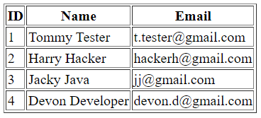
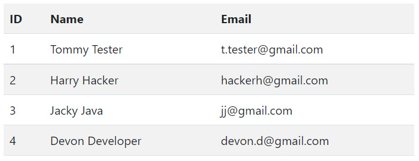

# Thymeleaf Demo

## 1.0 - Dynamic Text

1. [index.html](src/main/resources/templates/index.html) demonstrates using `th:text="${myVariabe}"` to inject values dynamically into the page.
    ```html
    <body>
        <p>This is a normal static content</p>
        <p th:text="${dynamicContent}">We don't need any text in here</p>
    </body>
    ```
2. [WebController.java](src/main/java/com/example/thymeleaf/WebController.java) contains `GET` mapping for requests to the index page. It takes a `Model` as an input so that we can pass attributes to the model which will then be passed to the index page where we can render its content.
   ```java 
   @GetMapping({"/",""})
    public String index(Model model){
        model.addAttribute("siteTitle","Thymeleaf Demo");
        model.addAttribute("dynamicContent","This is some dynamic content");
        return "/index";
    }
   ```
## 1.1 - Dynamic Lists
1. [index.html](src/main/resources/templates/index.html) shows how we can use `th:each"` to iterate through a list called "items", and then create a new `<li>` element for each list item. Then we set the value of the list item element to the value of that list item.
   ```html
   <ul>
      <li th:each="item : ${items}" th:text="${item}"></li>
   </ul>
   ```
2. [WebController.java](src/main/java/com/example/thymeleaf/WebController.java) shows how we add a list of items (in this case just strings) to the model
   ```java 
   @GetMapping({"/",""})
    public String index(Model model){
        model.addAttribute("siteTitle","Thymeleaf Demo");
        model.addAttribute("dynamicContent","This is some dynamic content");
        //Add the list of items
        model.addAttribute("items", List.of("Item A", "Item B", "Item C", "Item D"));
        return "/index";
    }
   ```
## 1.2 - Dynamic Tables
1. [index.html](src/main/resources/templates/index.html) shows how we can use `th:each"` to iterate through a list again, but this time the list is called "students", and contains [Student](src/main/java/com/example/thymeleaf/Student.java) objects.
   ```html
    <table border="1">
        <tr>
            <th>ID</th>
            <th>Name</th>
            <th>Email</th>
        </tr>
        <tr th:each="student : ${students}">
            <td th:text="${student.id}" ></td>
            <td th:text="${student.name}" ></td>
            <td th:text="${student.email}" ></td>
        </tr>
    </table>
   ```
2. In [WebController.java](src/main/java/com/example/thymeleaf/WebController.java) we add a list of [Student](src/main/java/com/example/thymeleaf/Student.java) objects to the model.
   ```java 
   model.addAttribute("students", List.of(
          new Student(1, "Tommy Tester", "t.tester@gmail.com"),
          new Student(2, "Harry Hacker", "hackerh@gmail.com"),
          new Student(3, "Jacky Java", "jj@gmail.com"),
          new Student(4, "Devon Developer", "devon.d@gmail.com")
   ));
   ```
   The index page will now show the following table 

## 2.0 - Fragments
1. A new [fragments](src/main/resources/templates/fragments) directory holds a new fragment [head](src/main/resources/templates/fragments/head.html). This fragment contains only the `<head>` element content, which now also includes the bootstrap cdn link.
2. The [index](src/main/resources/templates/index.html) now has its head element replaced with the following syntax, which simply instructs it to replace this head element with the head element that can be found in the `fragments/head` file.
   ```html
   <head th:replace="fragments/head"></head>
   ```
   When thymeleaf looks at `fragments/head`, it can see that it is a fragment by the `th:fragment="head"` declaration.
   Running the program now shows the table looking like below:
   

## 2.1 - Multiple fragments in a file (nesting fragments)
1. The new file [site.html](src/main/resources/templates/fragments/site.html) shows how multiple fragments can be grouped into the same file, but still used individually.<br/>
   This file contains:
   - A link to an external [CSS stylesheet](src/main/resources/static/css/site.css) imported demonstrating the `th:href` syntax to rewrite links, this CSS file is just there to set the page footer to the bottom of the page.
   - The `head` fragment.
   - The `footer` fragment 
2. [index.html]() has been altered to remove the call to `head.html` and replace it with the following call to the `head` fragment within the `site.html` fragment _(think of it like a method call within a class)_
   ```html
   <!--<head th:replace="fragments/head"></head>-->
   <head th:replace="fragments/site :: head"></head>
   ```
   `index.html` also has a declaration at the bottom of the page to include the footer element.
   ```html
   <footer th:replace="fragments/site :: footer"></footer>
   ```
## 2.2 - Navigation Fragment
1. A simple `nav` fragment has been added to [site.html](src/main/resources/templates/fragments/site.html) with conditional operators to dynamically change which link is active  
   ```html
   <nav th:fragment="nav" class="nav justify-content-center">
        <!-- Conditional operator to determine the active page -->
        <a th:class="${#strings.equalsIgnoreCase(pageTitle, 'Home')? 'nav-link active' : 'nav-link'}" th:href="@{/}">Home</a>
        <a th:class="${#strings.equalsIgnoreCase(pageTitle, 'About')? 'nav-link active' : 'nav-link'}" th:href="@{about}">About</a>
        <a th:class="${#strings.equalsIgnoreCase(pageTitle, 'Contact')? 'nav-link active' : 'nav-link'}" th:href="@{contact}">Contact</a>
    </nav>
   ```
2. The [about](src/main/resources/templates/about.html) and [contact](src/main/resources/templates/contact.html) pages were then created, at this stage they only import the `head` and `nav` fragments and are otherwise blank pages.
   ```html
   <!-- Simple content of the about and contact html pages -->
   <!DOCTYPE html>
   <html lang="en" xmlns:th="http://www.thymeleaf.org">
       <head th:replace="fragments/site :: head"></head>
       <body>
           <nav th:replace="fragments/site :: nav"></nav>
       </body>
   </html>
   ```
3. The [WebController](src/main/java/com/example/thymeleaf/WebController.java) must be updated to contain methods for the new `about.html` and `contact.html` pages, and another attribute has been added to the model to enable the active nav link operators to identify the page.
   ```java 
   @GetMapping("/about")
    public String about(Model model){
        model.addAttribute("siteTitle","Thymeleaf Demo");
        model.addAttribute("pageTitle", "About");
        return "/about";
    }
   ```
## 3.0 - Content
1. Added some dummy content to the `about` page, and a contact form to the `contact` page.
2. Added a [ContactMessage.java](src/main/java/com/example/thymeleaf/ContactMessage.java) class to receive messages from the contact form
3. Defined 2 x contact methods in the controller.
   - The first is declared as `GET` mapping and will be the method called when a user first visits the contact page.
   - The second is a `POST` mapped method and is called whenever a user submits the contact form.

## 3.1 - Dynamic Live Data
1. Added a [repository](src/main/java/com/example/thymeleaf/ContactMessageRepository.java) and [service](src/main/java/com/example/thymeleaf/MessageService.java) to manage the [ContactMessage](src/main/java/com/example/thymeleaf/ContactMessage.java)'s.
2. Removed the example info from the home page and modified the students table to show all the current contact messages (submitting the contact form will add the message to the table on the home page).
   ```html
   <h2 class="ms-3">Messages</h2>
   <table class="table table-striped table-hover ms-3" style="width: 550px;">
      <tr>
          <th>ID</th>
          <th>Email</th>
          <th>Message</th>
      </tr>
      <tr th:each="msg : ${messages}">
          <td th:text="${msg.id}" ></td>
          <td th:text="${msg.email}" ></td>
          <td th:text="${msg.message}" ></td>
      </tr>
   </table>
   ```
## 3.2 - Dynamic With Seed Data
1. Controller methods have been cleaned up, and website title now comes from [AppConfig.java](src/main/java/com/example/thymeleaf/AppConfig.java) (value defined in [application.yml](src/main/resources/application.yml))
2. **Messages** table on the home page has 2 extra columns at the end of each row for `Edit` and `Delete` buttons (Edit button not yet functional)
3. [MessageService](src/main/java/com/example/thymeleaf/MessageService.java) contains a few simple crud operations that are used by the controller and AppConfig class.

## 4.0 - Dynamic with filter search
The [site.html](src/main/resources/templates/fragments/site.html) fragment has been updated to include a CDATA function in the page scripts. This function runs each time a `keyup` event takes place and calls the `rebuildTable()` and `filterMessages()` functions in the [messageTableFilter](src/main/resources/static/js/messageTableFilter.js) javascript file.
   ```js
   /*<![CDATA[*/
   var messages =
      /*[[${messages}]]*/
      /*]]>*/
      $("#messageFilter").on("keyup", function () {
          var value = $(this).val();
          rebuildTable(filterMessages(value, messages));
   }); 
   ```
As their name implies, the `filterMessages()` function filters out any messages that match the given value, and the `rebuildTable()` function rebuilds the messages table to contain only those messages returned by `filterMessages()`.

## 5.0 - File upload and download
1. [upload.html](src/main/resources/templates/upload.html) allows users to upload a selected file of any type providing it does not exceed the file size limit.
   - Currently, the files are uploaded to a local pc directory. In production this would be assigned to a cloud server storage.
   - A [StudentCV]() object instance is created for every uploaded file, which stores an id, the filename, and the path to its respective storage location for easy retrieval .
   - Files that have been uploaded are shown in the table
2. GET and POST routes for `/upload` and `/download` have been refactored into [FileController.java](src/main/java/com/example/thymeleaf/controller/FileController.java) to keep them separated from the other standard wed routes.
## 5.1 - File open (in new tab)
Uploaded files can be opened directly in the browser if your browser supports it, otherwise they will be downloaded.
Known files to open in the browser:
- .pdf
- .txt
- .md
- .json
- .xml
- .png
- .jpg/jpeg

MS Word and Excel files will open directly into the app if installed on your machine, this applies to:
- doc
- docx
- xls
- xlsx

Any other file types will be downloaded.
___